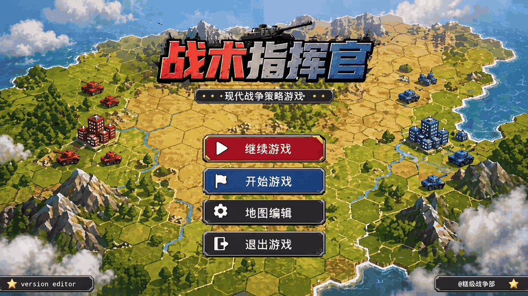
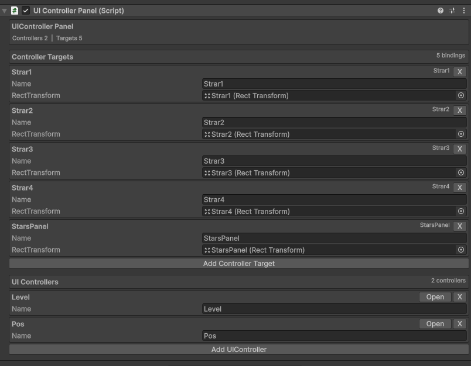
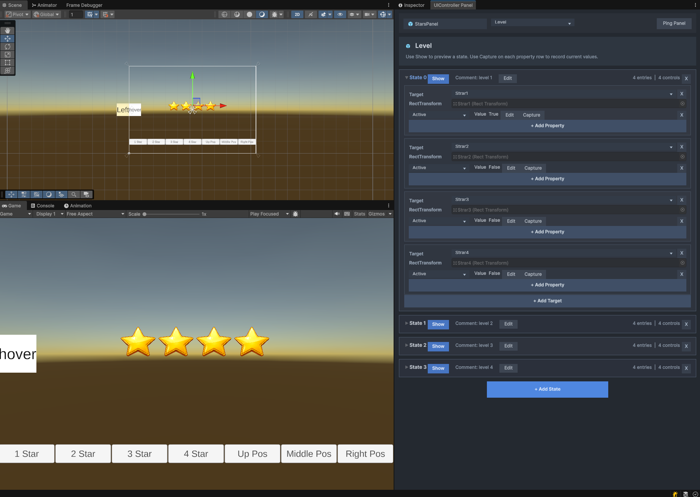

# UIController


UIController is a Unity UI state controller package for building reusable UI state workflows. It lets you bind named UI targets, define multiple controller states, capture UI values in the editor, and switch states at runtime with one API call. You can define reusable visual states directly on UI controls, such as selected button scaling, text color changes, image color changes, and other repeated UI effects.

UIController 是一个用于 Unity UI 状态控制的 Package，适合构建可复用的 UI 状态流程。它可以绑定命名 UI 目标、定义多个控制器状态、在编辑器中捕获 UI 数值，并在运行时通过一个 API 调用切换状态。你可以直接在控件上配置可复用的视觉状态，例如按钮选中时缩放、文字颜色变化、图片颜色变化等常见 UI 效果。

## Language / 语言

| English | 中文 |
| --- | --- |
| [Read English Documentation](#english) | [阅读中文文档](#中文) |

## Demo Video / 演示视频



## Screenshots / 截图展示

### UIController Panel Inspector



### UIController Panel Window



<a id="english"></a>

## English

### Contents

- [Features](#features)
- [Requirements](#requirements)
- [Installation](#installation)
- [Source Code](#source-code)
- [Quick Start](#quick-start)
- [Runtime API](#runtime-api)
- [Supported Properties](#supported-properties)
- [Custom Properties](#custom-properties)
- [Editor Tools](#editor-tools)
- [Roadmap](#roadmap)
- [Repository Layout](#repository-layout)
- [Development](#development)
- [License](#license)

### Features

- Define named UI controllers and states in the Unity Inspector.
- Bind controller targets by name to `RectTransform` objects.
- Capture current UI values into a state from editor tools.
- Preview state changes in the editor.
- Apply states at runtime by controller name and state index.
- Reuse common control effects, such as selected button scaling and highlighted text or image colors.
- Animate supported numeric, vector, and color properties through DOTween.

### Requirements

- The package uses common Unity UI and editor APIs and is intended to work with recent Unity versions.
- Unity UI package: `com.unity.ugui`.
- DOTween is expected by the runtime animation code.

### Installation

Recommended: download the latest release package from [GitHub Releases](https://github.com/windsmoon/UIController/releases), then import it into your Unity project.

DOTween note: if your project already has DOTween installed, and the release package you imported also contains DOTween, delete the duplicated DOTween folder from the imported package to avoid duplicate references or type conflicts.

### Source Code

If you download the repository source code directly from GitHub, the package code is at the repository root:

- `Runtime/`: runtime scripts included in the package.
- `Editor/`: Unity editor scripts included in the package.
- `package.json`: Unity Package Manager manifest.
- `UnityProject~/`: local demo and development Unity project.

Open `UnityProject~` only when you want to inspect or run the demo project. The package source itself is not inside `UnityProject~`; it lives in `Runtime/` and `Editor/` at the repository root.

### Quick Start

1. Add `UIControllerPanel` to a UI object.
2. In **Controller Targets**, add named target bindings and assign their `RectTransform`.
3. Add one or more UI controllers.
4. Add states to each controller.
5. Add target states and properties, then use **Capture** to save current values.
6. Switch states from code:

```csharp
using Windsmoon.UIController;
using UnityEngine;

public class Example : MonoBehaviour
{
    [SerializeField]
    private UIControllerPanel _panel;

    public void ShowLevelTwo()
    {
        _panel.SetControllerState("Level", 1);
    }
}
```

### Runtime API

```csharp
public void SetControllerState(string controllerName, int stateIndex, bool forceNoAnimation = false)
public bool HasController(string controllerName)
public bool HasControllerState(string controllerName, int stateIndex)
```

Parameters:

- `controllerName`: The name of the UI controller configured in the panel.
- `stateIndex`: The zero-based state index.
- `forceNoAnimation`: Applies values immediately when `true`.

Use `HasController` and `HasControllerState` when you need to check whether a controller or state exists before switching UI state.

### Supported Properties

| Property | Target | Value | Animation |
| --- | --- | --- | --- |
| `Active` | `GameObject` | `activeSelf` | No |
| `AnchoredPosition` | `RectTransform` | `anchoredPosition` | Yes |
| `LocalScale` | `RectTransform` | `localScale` | Yes |
| `SizeDelta` | `RectTransform` | `sizeDelta` | Yes |
| `CanvasGroupAlpha` | `CanvasGroup` | `alpha` | Yes |
| `ImageColor` | `UnityEngine.UI.Image` | `color` | Yes |
| `TextForTextMesh` | `TextMeshProUGUI` | `text` | No |
| `TextMeshColor` | `TextMeshProUGUI` | `color` | Yes |

### Custom Properties

Current extension workflow:

1. Create a new class that inherits from `UIControllerProperty<T>`.
2. Implement `Name`, `IsValid`, `Capture`, `GetCurrentValue`, `GetTargetValue`, `SetCurrentValue`, and `GetValueText`.
3. Register the property in `UIControllerPropertyFactory` so it appears in the editor property dropdown.

Example:

```csharp
using System;
using Windsmoon.UIController.Properties;
using UnityEngine;
using UnityEngine.UI;

[Serializable]
public class UIControllerButtonInteractableProperty : UIControllerProperty<bool>
{
    public const string PropertyName = "ButtonInteractable";

    public override string Name => PropertyName;

    public override bool IsValid(RectTransform rectTransform, out string errorMessage)
    {
        if (GetButton(rectTransform) != null)
        {
            errorMessage = null;
            return true;
        }

        errorMessage = "Target has no Button component.";
        return false;
    }

    public override void Capture(RectTransform rectTransform)
    {
        Button button = GetButton(rectTransform);
        if (button != null)
        {
            _value = button.interactable;
        }
    }

    public override bool GetCurrentValue(RectTransform rectTransform)
    {
        Button button = GetButton(rectTransform);
        return button != null ? button.interactable : _value;
    }

    public override bool GetTargetValue()
    {
        return _value;
    }

    public override void SetCurrentValue(RectTransform rectTransform, bool value)
    {
        Button button = GetButton(rectTransform);
        if (button != null)
        {
            button.interactable = value;
        }
    }

    public override string GetValueText()
    {
        return _value ? "True" : "False";
    }

    private static Button GetButton(RectTransform rectTransform)
    {
        return rectTransform != null ? rectTransform.GetComponent<Button>() : null;
    }
}
```

Then register it in `UIControllerPropertyFactory`:

```csharp
new UIControllerPropertyDefinition(UIControllerButtonInteractableProperty.PropertyName, () => new UIControllerButtonInteractableProperty()),
```

Editor value editing currently supports `bool`, `string`, `float`, `Vector2`, `Vector3`, and `Color`. Runtime animation currently supports `float`, `Vector2`, `Vector3`, and `Color` when `CanAnimate` is `true`.

### Editor Tools

- Inspector integration for `UIControllerPanel`.
- Dedicated editor window: **Window > Framework > UI > UIController Panel**.
- Controller, target, and property dropdowns.
- Capture and edit property values.
- Configure animation ease type and duration for animated properties.
- Preview state transitions in the editor.

### Roadmap

- Improve documentation.
- Better editor experience.
- Better and more demos.
- Node-based state editor.
- Fallback animation methods when DOTween is not available.
- More built-in property support.
- Custom property extensions without modifying package source code.
- More supported animation value types.

### Repository Layout

```text
Runtime/          Runtime package code
Editor/           Unity editor tooling
Samples~/         Sample package content
Documentation~/   Package documentation
Tests~/           Hidden test folder
UnityProject~/    Local development Unity project
```

`UnityProject~` is only for local development. The trailing `~` keeps Unity Package Manager from importing it as package content.

### Development

The local Unity project references the package from the repository root:

```json
"com.windsmoon.uicontroller": "file:../../"
```

Open `UnityProject~` in Unity when you want to test the package locally.

### License

MIT. See [LICENSE](LICENSE).

<a id="中文"></a>

## 中文

### 目录

- [功能特性](#功能特性)
- [环境要求](#环境要求)
- [安装方式](#安装方式)
- [源码位置](#源码位置)
- [快速开始](#快速开始)
- [运行时 API](#运行时-api)
- [支持的属性](#支持的属性)
- [自定义属性](#自定义属性)
- [编辑器工具](#编辑器工具)
- [后续计划](#后续计划)
- [仓库结构](#仓库结构)
- [开发说明](#开发说明)
- [许可证](#许可证)

### 功能特性

- 在 Unity Inspector 中配置命名 UI Controller 和多个状态。
- 通过名称把 Controller Target 绑定到具体 `RectTransform`。
- 在编辑器中一键捕获当前 UI 值到状态配置。
- 支持编辑器内预览状态切换。
- 运行时通过一个 API 按 Controller 名称和状态索引切换 UI。
- 复用常见控件效果，例如按钮选中缩放、文字高亮、图片变色等状态表现。
- 对数值、向量、颜色类属性支持 DOTween 动画。

### 环境要求

- 本包使用常见的 Unity UI 和编辑器 API，理论上近期 Unity 版本都支持。
- Unity UI 包：`com.unity.ugui`。
- 运行时动画代码依赖 DOTween。

### 安装方式

推荐方式：从 [GitHub Releases](https://github.com/windsmoon/UIController/releases) 下载最新 Release 包，然后导入到 Unity 工程。

DOTween 引用提示：如果你的项目里已经安装了 DOTween，而导入的 Release 包里也带了 DOTween，可以把包里重复的 DOTween 文件夹删掉，避免重复引用或类型冲突。

### 源码位置

如果你直接从 GitHub 下载源码工程，包代码在仓库根目录：

- `Runtime/`：会进入包的运行时代码。
- `Editor/`：会进入包的 Unity 编辑器代码。
- `package.json`：Unity Package Manager 的包清单。
- `UnityProject~/`：本地演示和开发用 Unity 工程。

只有需要查看或运行演示工程时才打开 `UnityProject~`。真正的 Package 源码不在 `UnityProject~` 里面，而是在仓库根目录的 `Runtime/` 和 `Editor/`。

### 快速开始

1. 在 UI 对象上添加 `UIControllerPanel`。
2. 在 **Controller Targets** 中添加目标绑定，并指定对应的 `RectTransform`。
3. 添加一个或多个 UI Controller。
4. 给 Controller 添加状态。
5. 给状态添加 Target 和属性，然后点击 **Capture** 捕获当前值。
6. 在代码中切换状态：

```csharp
using Windsmoon.UIController;
using UnityEngine;

public class Example : MonoBehaviour
{
    [SerializeField]
    private UIControllerPanel _panel;

    public void ShowLevelTwo()
    {
        _panel.SetControllerState("Level", 1);
    }
}
```

### 运行时 API

```csharp
public void SetControllerState(string controllerName, int stateIndex, bool forceNoAnimation = false)
public bool HasController(string controllerName)
public bool HasControllerState(string controllerName, int stateIndex)
```

参数说明：

- `controllerName`：在面板中配置的 UI Controller 名称。
- `stateIndex`：从 `0` 开始的状态索引。
- `forceNoAnimation`：为 `true` 时立即应用目标值，不播放动画。

需要在切换 UI 状态前判断 Controller 或 State 是否存在时，可以使用 `HasController` 和 `HasControllerState`。

### 支持的属性

| 属性 | 目标组件 | 控制值 | 支持动画 |
| --- | --- | --- | --- |
| `Active` | `GameObject` | `activeSelf` | 否 |
| `AnchoredPosition` | `RectTransform` | `anchoredPosition` | 是 |
| `LocalScale` | `RectTransform` | `localScale` | 是 |
| `SizeDelta` | `RectTransform` | `sizeDelta` | 是 |
| `CanvasGroupAlpha` | `CanvasGroup` | `alpha` | 是 |
| `ImageColor` | `UnityEngine.UI.Image` | `color` | 是 |
| `TextForTextMesh` | `TextMeshProUGUI` | `text` | 否 |
| `TextMeshColor` | `TextMeshProUGUI` | `color` | 是 |

### 自定义属性

当前版本的扩展方式：

1. 新建一个类，继承 `UIControllerProperty<T>`。
2. 实现 `Name`、`IsValid`、`Capture`、`GetCurrentValue`、`GetTargetValue`、`SetCurrentValue`、`GetValueText`。
3. 在 `UIControllerPropertyFactory` 中注册这个属性，让它出现在编辑器属性下拉菜单里。

示例：

```csharp
using System;
using Windsmoon.UIController.Properties;
using UnityEngine;
using UnityEngine.UI;

[Serializable]
public class UIControllerButtonInteractableProperty : UIControllerProperty<bool>
{
    public const string PropertyName = "ButtonInteractable";

    public override string Name => PropertyName;

    public override bool IsValid(RectTransform rectTransform, out string errorMessage)
    {
        if (GetButton(rectTransform) != null)
        {
            errorMessage = null;
            return true;
        }

        errorMessage = "Target has no Button component.";
        return false;
    }

    public override void Capture(RectTransform rectTransform)
    {
        Button button = GetButton(rectTransform);
        if (button != null)
        {
            _value = button.interactable;
        }
    }

    public override bool GetCurrentValue(RectTransform rectTransform)
    {
        Button button = GetButton(rectTransform);
        return button != null ? button.interactable : _value;
    }

    public override bool GetTargetValue()
    {
        return _value;
    }

    public override void SetCurrentValue(RectTransform rectTransform, bool value)
    {
        Button button = GetButton(rectTransform);
        if (button != null)
        {
            button.interactable = value;
        }
    }

    public override string GetValueText()
    {
        return _value ? "True" : "False";
    }

    private static Button GetButton(RectTransform rectTransform)
    {
        return rectTransform != null ? rectTransform.GetComponent<Button>() : null;
    }
}
```

然后在 `UIControllerPropertyFactory` 中注册：

```csharp
new UIControllerPropertyDefinition(UIControllerButtonInteractableProperty.PropertyName, () => new UIControllerButtonInteractableProperty()),
```

编辑器值编辑当前支持 `bool`、`string`、`float`、`Vector2`、`Vector3`、`Color`。运行时动画当前支持在 `CanAnimate` 为 `true` 时动画 `float`、`Vector2`、`Vector3`、`Color`。

### 编辑器工具

- `UIControllerPanel` 的 Inspector 集成。
- 独立编辑窗口：**Window > Framework > UI > UIController Panel**。
- Controller、Target、Property 下拉选择。
- 支持捕获和编辑属性值。
- 支持为可动画属性配置动画类型和动画时长。
- 支持在编辑器内预览状态切换。

### 后续计划

- 完善文档。
- 更好的编辑器体验。
- 更好更多的 demo。
- 节点式状态编辑器。
- 无 DOTween 时回退到其他动画方法。
- 更多内置属性支持。
- 自定义属性扩展无需修改包源码。
- 更多可支持的动画类型。

### 仓库结构

```text
Runtime/          运行时代码
Editor/           Unity 编辑器工具
Samples~/         示例内容
Documentation~/   包文档
Tests~/           隐藏测试目录
UnityProject~/    本地开发用 Unity 工程
```

`UnityProject~` 只用于本地开发。目录名末尾的 `~` 会让 Unity Package Manager 忽略它，避免开发工程被当作包内容导入。

### 开发说明

本地 Unity 工程通过仓库根目录引用当前包：

```json
"com.windsmoon.uicontroller": "file:../../"
```

需要本地调试包时，打开 `UnityProject~` 工程即可。

### 许可证

MIT。详见 [LICENSE](LICENSE)。
